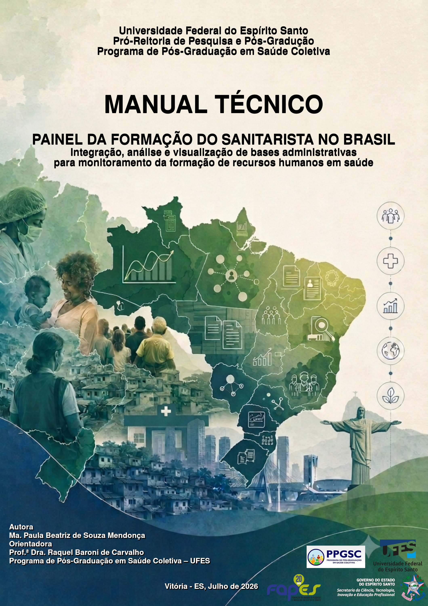

# Início {#inicio}

::: {.hero-buttons}

Conheça os diferentes caminhos formativos, explore a distribuição da oferta de formação no país e acesse materiais sobre a formação e a regulamentação da profissão.

:::

## Apresentação {#sobre}

O Observatório da Formação do Sanitarista no Brasil nasce como um espaço para reunir e disponibilizar informações sobre os diferentes caminhos formativos disponíveis no sistema de educação superior brasileiro para a formação da força de trabalho do sanitarista.

O Observatório é um produto da pesquisa de doutorado desenvolvida no Programa de Pós-Graduação em Saúde Coletiva da Universidade Federal do Espírito Santo (UFES). 

Como parte desse espaço, o Painel da Formação do Sanitarista no Brasil reúne informações qualificadas, provenientes de diferentes bases de dados governamentais oficiais, sobre quatro segmentos formativos: graduação; pós-graduação lato sensu; residências médicas, uniprofissionais e multiprofissionais; e pós-graduação stricto sensu.

O Observatório também disponibiliza o manual técnico do Painel, uma biblioteca de materiais sobre a história, a formação e a avaliação dos cursos e programas, além de legislações relacionadas à regulamentação da profissão.

Esperamos que este espaço constitua uma ferramenta de apoio para estudantes, pesquisadores, gestores, instituições formadoras e demais interessados na compreensão da formação do sanitarista e em sua contribuição para o fortalecimento do SUS.

## Objetivo {#objetivo}

O Observatório da Formação do Sanitarista no Brasil tem como objetivo reunir, organizar e disponibilizar informações qualificadas sobre a formação do sanitarista, contribuindo para a compreensão dos diferentes caminhos formativos, das desigualdades territoriais e dos processos de regulamentação e profissionalização da categoria.

## Quem pode ser sanitarista?

De acordo com a Lei nº 14.725/2023, podem habilitar-se ao exercício da profissão de sanitarista aqueles que atendam aos requisitos previstos na legislação, incluindo:

- diplomados em curso de graduação reconhecido pelo Ministério da Educação e classificado na área de Saúde Coletiva ou Saúde Pública;
- diplomados em curso de mestrado ou doutorado na área de Saúde Coletiva ou Saúde Pública, conforme os requisitos legais;
- diplomados em curso de graduação na área de Saúde Coletiva ou Saúde Pública realizado no exterior, com diploma revalidado no Brasil;
- portadores de certificado de conclusão de Residência Médica ou Residência Multiprofissional em Saúde na área de Saúde Coletiva ou Saúde Pública;
- portadores de certificado de especialização lato sensu na área de Saúde Coletiva ou Saúde Pública, observados os requisitos legais;
- profissionais com formação de nível superior que comprovem, nos termos da lei, o exercício de atividade profissional correlata por pelo menos cinco anos até a data de publicação da Lei.

Consulte a legislação vigente para conhecer os requisitos completos.

O exercício da profissão requer registro profissional no órgão competente do SUS. O Decreto nº 12.921/2026 regulamenta os procedimentos e documentos necessários para o registro profissional. O registro profissional de sanitarista é gratuito e deve ser solicitado de forma totalmente digital pelo SIRP-MS (Sistema de Registro Profissional) do Ministério da Saúde pelo site [https://degerts.unasus.gov.br/sirp-ms](https://degerts.unasus.gov.br/sirp-ms) 

# O Observatório em números {#indicadores}

Os indicadores apresentados neste painel permitem explorar diferentes
dimensões da formação do sanitarista no Brasil.

::: {.indicator-grid}

::: {.indicator-card}
### Entre cursos e programas

**1.335**

:::

::: {.indicator-card}
### Instituições

**Mais de 404**

:::

::: {.indicator-card}
### Estados

**26 + DF**

:::

::: {.indicator-card}
### Vagas entre os segmentos formativos

**150.000**

:::

:::

::: {.dashboard-section}

## Explorar os dados

O painel interativo reúne as principais informações e indicadores da formação do sanitarista no Brasil. Os dados são apresentados em distinta para cada segmento formativo.

:::

# Painel da Formação do Sanitarista no Brasil {#dashboard}

## Explore os dados

O painel interativo reúne as principais visualizações e indicadores da formação do sanitarista no Brasil.

<iframe
  src="https://app.powerbi.com/view?r=eyJrIjoiZjU5NjRhYjgtZTk3Ni00OTQ0LWI4YjQtYTM5NTEzZjM5ZTBlIiwidCI6IjI4NTJmYzhhLWViNWUtNDk1My05ODUxLWE1YTVkNDkxNWRiOSJ9&pageName=da45889edbe898e31349"
  width="100%"
  height="700"
  frameborder="0"
  marginheight="0"
  marginwidth="0">
</iframe>

# Manual Técnico

O manual do painel apresenta informações sobre sua utilização e instruções da arquitetura de construção do painel. 

::: {.manual-card}

[Consultar o manual →](https://drive.google.com/drive/folders/1pQQQD2-ZwpYP7rC8IGjrHV_4fCZacEmj)

:::

## Fontes de dados

- e-MEC 
- SISCNRM - via Painel da Educação Superior
- SINAR - via Painel da Educação Superior
- Plataforma Sucupira 

## Biblioteca {#biblioteca}

Acesse materiais sobre história, formação, avaliação e regulamentação da profissão da profissão de sanitarista.

[Consultar a Biblioteca →](https://drive.google.com/drive/folders/1kVZeDNzOoANZLjGV5ImRXDo_r7rluW9P)

## Atualização

**Última atualização:** 18/08/2026

# Contato

Para dúvidas, sugestões e informações sobre o Observatório e o Painel da Formação do Sanitarista no Brasil envie para o e-mail:paineldaformacaodosanitarista@gmail.com

# Quem Somos {#quem-somos}

::: {.quem-somos}

::: {.foto}
{fig-alt="Paula"}
:::

::: {.biografia}
### Ma. Paula Beatriz de Souza Mendonça

Doutoranda em Saúde Coletiva pela Universidade Federal do Espírito Santo (UFES), pesquisadora na área de formação e profissionalização do sanitarista. É responsável pela criação e desenvolvimento do Observatório da Formação do Sanitarista no Brasil, produto de sua pesquisa de doutorado.

:::

:::

::: {.quem-somos}

::: {.foto}
{fig-alt="Raquel"}
:::

:::{.biografia}
### Profa. Dra. Raquel Baroni de Carvalho

Professora Titular do Dept. de Medicina Social da Universidade Federal do Espírito Santo (UFES) e dos Programas de Pós-Graduação em Ciências Odontológicas e Saúde Coletiva, orientadora da pesquisa de doutorado que deu origem ao Observatório.

:::

:::